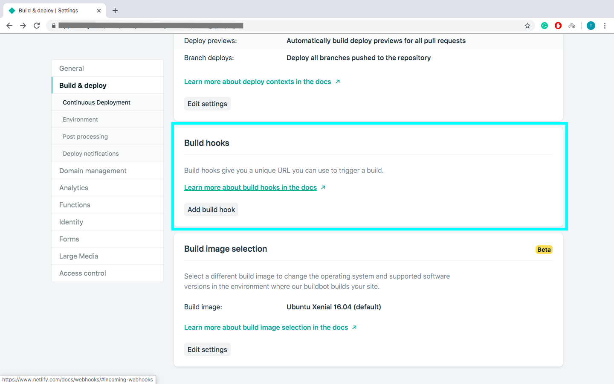
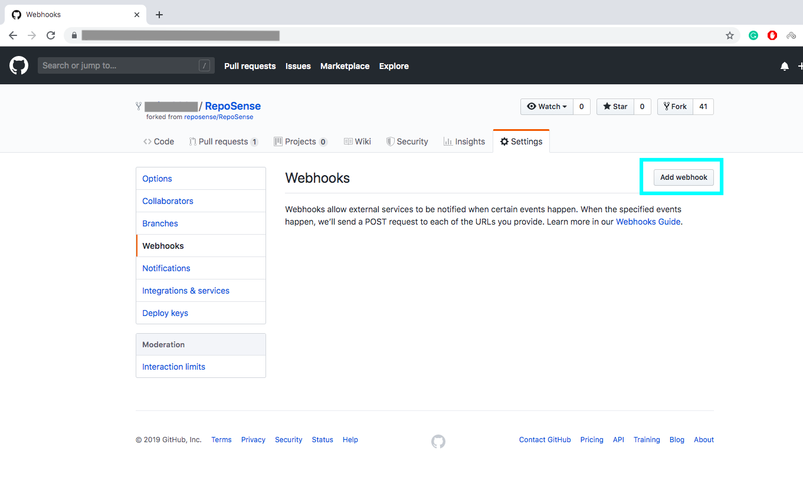
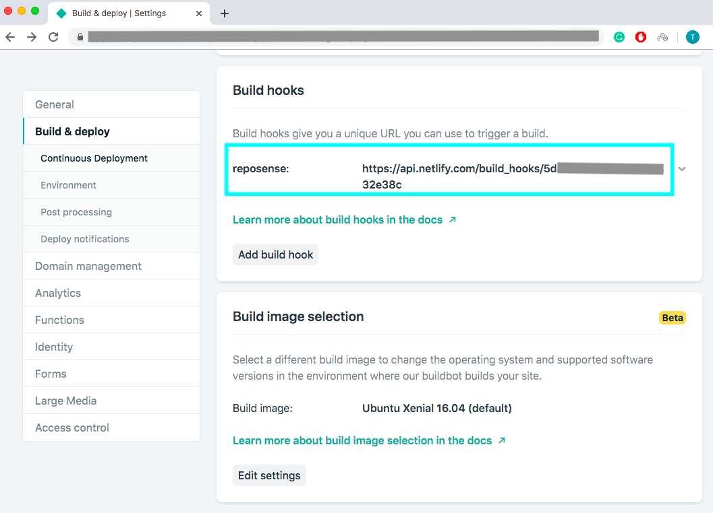

<frontmatter>
  header: header.md
  footer: footer.md
  siteNav: usingNetlifyGuideNavigation.md
</frontmatter>

## Using RepoSense with Netlify

Netlify's continuous web deployment platform enables you to deploy RepoSense online, analyzes your target repository(s) and generates the git contribution report in real time for free. The deployment can be synchronized to the updates on your target repository(s) and you can perform everything through the browser without downloading any files.

1. Fork the RepoSense repository using this [link](https://github.com/repoSense/RepoSense/fork).
1. Follow this [guide](https://www.netlify.com/blog/2016/09/29/a-step-by-step-guide-deploying-on-netlify/) to set up Netlify in your forked repository. You will need to use the following in [Step 5](https://www.netlify.com/blog/2016/09/29/a-step-by-step-guide-deploying-on-netlify/#step-5-configure-your-settings):

   **Build command**:
   ```
   ./gradlew run -Dargs="--repos YOUR_TARGET_REPO"
   ```
   **Publish directory**:
   ```
   ./reposense-report
   ```

These steps will allow you to take the first look at your report. To enable continuous deployment of the report, refer below to [Continuous deployment using Netlify](#continuous-deployment-using-netlify) for further instructions.


### Continuous deployment using Netlify

1. Click on **Settings** in the top, choose **Build & deploy** from the left panel and scroll to **Build hooks**.
   
1. Click **Add build hook**, give your webhook a name, and choose the `master` branch to build. A Netlify URL will be generated.
1. Go to your target repository (the repository you want to analyze) and click on **Settings**.
1. Select **Webhooks** on left panel and click on **Add webhook**.
   
1. Copy the Netlify URL and paste it in the URL form field.
   
   > Note: Although the build url is not that secretive, it should be kept safe to prevent any misuse.
1. Select **application.json** as content type.
1. Select **Let me select individual events** and based on your requirements check the checkboxes.
1. Leave the **Active** checkbox checked.
1. Click on **Add webhook** to save the webhook and add it.

> This should cause Netlify to deploy your site each and every time based on your checked checkboxes. Please make sure your forked repository is **up-to-date** with upstream to enjoy the latest features.

### If you wish to customize using `config files`

Using `config files` lets you generate a more customised report. Please refer to [how to customize using csv config files](UserGuide.md#customize-using-csv-config-files) for a more detailed explanation.

In **Step 5** for **Build Command** use:

```
./gradlew run -Dargs="--config ./config/"
```

Alternatively, if you want to customise the location of the config files, use:
```
./gradlew run -Dargs="--config YOUR_CONFIG_FILE_LOCATION"
```
