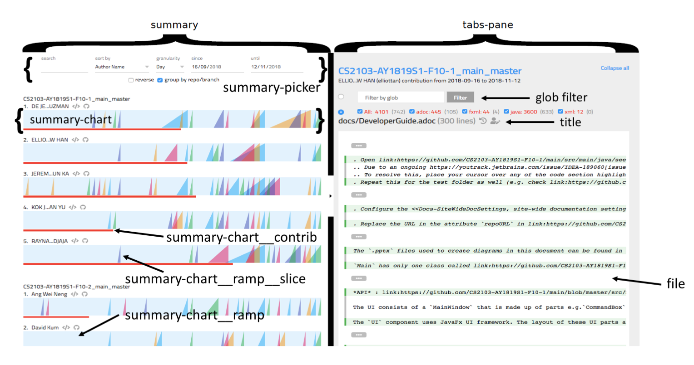

## Quick Start
1. Check [dependencies](##Dependencies)
2. Fill the CSV [config file](##CSV-Config-File)
3. Generate the [dashboard](##how-to-generate-dashboard)
4. Profit

## Dependencies
1. Git
2. Gradle
## How to Generate Dashboard
1. GUI
```sh
$ gradle clean run
```
2. CLI
```sh
$ gradle clean build
```
Unzip the file in build/distributions/
```
$ cd build/distributions/GitGrader/bin/
$ ./GitGrader -config CSV_path.csv -output output_path/ -since 01/10/2017 -until 01/11/2017
```
Argument List:
- config: Mandatory. The path to the CSV config file.
- output: Optional. The path to the dashboard generated. If not provided, it will be generated in the current directory.
- since : Optional. start date of analysis. Format: dd/MM/yyyy
- until : Optional. end date of analysis. Format: dd/MM/yyyy


## CSV Config File
The CSV Config files control the list of target repositories. It also contains a white list of authors(if the author is listed in the CSV, his/her contribution will be ignored by the analyzer.)
[Sample_full.csv](../sample_full.csv) in root is an example CSV config file. It should contain the following columns:
Column Name | Explanation
------------- | -------------
Organization | Organization of the target repository
Repository | Name of the target repository
branch | Target branch
StudentX's Github ID | Author's Github ID.
StudentX's Display Name | Optional Field. The value of this field, if not empty,will be displayed in the dashboard instead of author's Github ID.
StudentX's Local Author Name | Detailed explanation below

## Preparation of Repositories
### Local Git Author Name
First, what is Git Author Name? 

Git Author Name refers to the customizable Git Author Display Name set in local .gitconfig file. It will be displayed as Author name and Committer Name in Git. For example, in Git Log output:
```
...
commit cd7f610e0becbdf331d5231887d8010a689f87c7
Author: fakeAuthor <ma.tanghao@dhs.sg>
Date:   Fri Feb 9 19:14:41 2018 +0800

    moved

commit e3f699fd4ef128eebce98d5b4e5b3bb06a512f49
Author: harryggg <ma.tanghao@dhs.sg>
Date:   Fri Feb 9 19:13:13 2018 +0800

    new
 ...
```
*fakeAuthor* and *harryggg* are both Local Git Author Name.

RepoSense assumes that authors' local Author Name is identical as their Github ID. However, it is not always the case. Many Git users will customize their local author name. Authors can use the following command to set the their local author name to Github ID before contributing:
```
git config --global user.name “YOUR_GITHUB_ID_HERE”
```
If an author's local Git Author Name is not the same as his Github ID, he needs to fill in their local Author Name in the CSV config file. If more than one local Author Name is used, they can separate them with semicolon (；)

### Contribution Tags
Although RepoSense's contribution analysis is quite accurate, authors can still use annotations to make sure that RepoSense correctly recognize their contribution. Special thanks to [Collate](https://github.com/se-edu/collate) for providing the inspiration for this functionality.

There are 2 types of tags: Start Tags (@@author YOUR_GITHUB_ID) and End Tags(@@author). Below are some examples:
 
 
 
 
 
You can use start tags to mark the start of your contribution. The author specified in the start tag will be recognized by RepoSense as the author for all lines between a start tag and the next end tag. If RepoSense cannot find a matching End Tag for a Start Tag in the same file, it will assume that all lines between the Start Tag to the end of the file is authored by the author specified in the Start Tag.


## Dashboard

The dashboard is written in HTML and Javascript, so you can easily publish and share it. Below is what the Dashboard looks like:



It is consisted of three main parts: tool bar, Chart Panel and Code Panel.